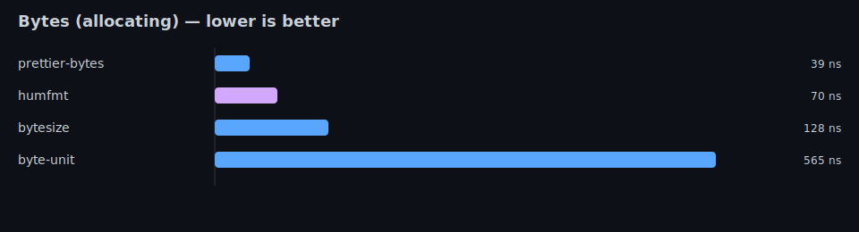
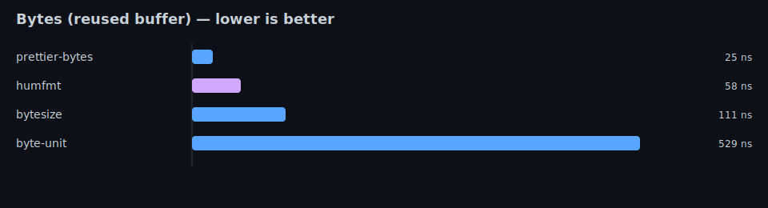
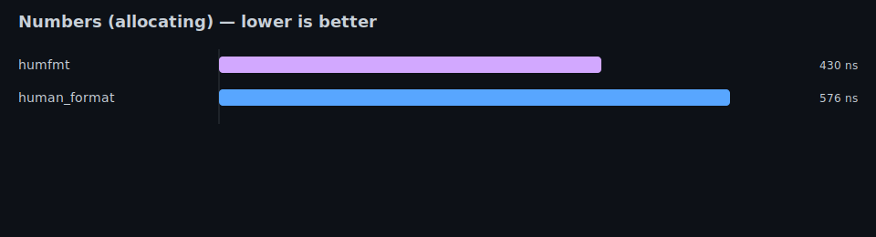

<div align="center">

# humfmt

**Ergonomic human-readable formatting toolkit for Rust**

[](https://github.com/MuXolotl/humfmt/actions/workflows/ci.yml)


</div>

---

`humfmt` turns raw machine values into readable text without turning formatting
into a side quest.

It currently includes:

- compact numbers like `15320 -> 15.3K`
- byte sizes like `1536 -> 1.5KB`
- ordinals like `21 -> 21st`
- durations like `3661s -> 1h 1m`
- relative time like `90s -> 1m 30s ago`
- natural-language lists like `["red", "green", "blue"] -> "red, green, and blue"`
- locale-aware output for English, Russian, and Polish
- custom locale overrides for suffixes, separators, ordinals, and duration units
- optional `chrono` and `time` integration

The goal is still the same: keep the crate small, predictable, and pleasant to
reach for.

---

## Quick Example

```rust
use humfmt::Humanize;

fn main() {
    println!("{}", humfmt::bytes(1536)); // 1.5KB
    println!("{}", humfmt::number(15320)); // 15.3K
    println!("{}", 1_500_000.human_number()); // 1.5M
    println!("{}", humfmt::ordinal(21)); // 21st
    println!("{}", humfmt::duration(core::time::Duration::from_secs(3661))); // 1h 1m
    println!("{}", humfmt::ago(core::time::Duration::from_secs(90))); // 1m 30s ago
    println!("{}", humfmt::list(&["red", "green", "blue"])); // red, green, and blue
}
```

---

## Performance Notes

`humfmt` is designed to be cheap to call from hot paths:

- The formatters implement `Display` and write directly to the provided `fmt::Formatter`.
- The formatting path avoids building intermediate heap strings.
- Allocation is an explicit choice of the caller (e.g. calling `.to_string()` allocates because it must own a `String`).

In other words: formatting itself is meant to be lightweight; if you need owned output,
you can allocate it explicitly.

---

## Customized Formatting

```rust
use core::time::Duration;

use humfmt::{BytesOptions, DurationOptions, Humanize, NumberOptions};

fn main() {
    let disk = 1536_u64.human_bytes_with(BytesOptions::new().binary());
    println!("{disk}"); // 1.5KiB

    let number = 15_320.human_number_with(
        NumberOptions::new()
            .precision(2)
            .long_units(),
    );
    println!("{number}"); // 15.32 thousand

    let elapsed = Duration::from_millis(1500)
        .human_duration_with(DurationOptions::new().long_units());
    println!("{elapsed}"); // 1 second 500 milliseconds

    let relative = Duration::from_secs(3665)
        .human_ago_with(DurationOptions::new().max_units(3));
    println!("{relative}"); // 1h 1m 5s ago
}
```

---

## List Examples

```rust
use humfmt::{list, list_with, ListOptions};

let english = list(&["red", "green", "blue"]);
assert_eq!(english.to_string(), "red, green, and blue");

let plain = list_with(
    &["red", "green", "blue"],
    ListOptions::new()
        .serial_comma_enabled(false)
        .conjunction("plus"),
);
assert_eq!(plain.to_string(), "red, green plus blue");
```

---

## Locale Examples

```rust
use core::time::Duration;

use humfmt::{
    duration_with, list_with, number_with,
    locale::Russian,
    DurationOptions, ListOptions, NumberOptions
};

let number = number_with(15_320, NumberOptions::new().locale(Russian));
assert_eq!(number.to_string(), "15,3 тыс.");

let elapsed = duration_with(
    Duration::from_secs(3665),
    DurationOptions::new()
        .locale(Russian)
        .long_units()
        .max_units(3),
);
assert_eq!(elapsed.to_string(), "1 час 1 минута 5 секунд");

let items = list_with(
    &["яблоки", "груши", "сливы"],
    ListOptions::new().locale(Russian),
);
assert_eq!(items.to_string(), "яблоки, груши и сливы");
```

```rust
use core::time::Duration;

use humfmt::{
    ago_with, number_with, ordinal_with,
    locale::Polish,
    DurationOptions, NumberOptions
};

let number = number_with(15_320, NumberOptions::new().locale(Polish));
assert_eq!(number.to_string(), "15,3 tys.");
assert_eq!(ordinal_with(21, Polish).to_string(), "21.");

let relative = ago_with(
    Duration::from_secs(90),
    DurationOptions::new().locale(Polish).long_units(),
);
assert_eq!(relative.to_string(), "1 minuta 30 sekund temu");
```

```rust
use humfmt::{
    ago_with,
    number_with,
    DurationOptions,
    NumberOptions,
    locale::{CustomLocale, DurationUnit},
};

fn custom_duration_unit(unit: DurationUnit, count: u128, long: bool) -> &'static str {
    if !long {
        return match unit {
            DurationUnit::Minute => "m",
            DurationUnit::Second => "s",
            _ => "?",
        };
    }

    match unit {
        DurationUnit::Minute if count == 1 => "tick",
        DurationUnit::Minute => "ticks",
        DurationUnit::Second if count == 1 => "tock",
        DurationUnit::Second => "tocks",
        _ => "units",
    }
}

let locale = CustomLocale::english()
    .short_suffix(1, "k")
    .separators(',', '.')
    .list_separator(" | ")
    .duration_unit_fn(custom_duration_unit)
    .ago_word("back");

let number = number_with(15_320, NumberOptions::new().locale(locale));
assert_eq!(number.to_string(), "15,3k");

let relative = ago_with(
    core::time::Duration::from_secs(90),
    DurationOptions::new().locale(locale).long_units(),
);
assert_eq!(relative.to_string(), "1 tick 30 tocks back");
```

---

## Current Features

- compact number formatter
- byte-size formatter
- ordinal formatter
- duration formatter
- relative time formatter
- list formatter
- long and short units
- English, Russian, and Polish locale packs
- custom locale builder for suffix and separator overrides
- configurable list separator per locale
- custom duration-unit, list-style, and relative-time wording hooks
- optional `chrono` and `time` integration
- checked `chrono/time` adapters with detailed conversion errors
- doctests and integration tests

---

## Installation

```toml
[dependencies]
humfmt = "0.2"
```

For `no_std` targets:

```toml
[dependencies]
humfmt = { version = "0.2", default-features = false }
```

---

## Feature Flags

- `std` (default): enables the standard-library build
- `default-features = false`: builds for `no_std`
- `english`: baseline locale included in the default feature set
- `russian`: enables the `humfmt::locale::Russian` locale pack
- `polish`: enables the `humfmt::locale::Polish` locale pack
- `alloc`: reserved compatibility flag in `0.2.x`
- `chrono`: enables adapters for `chrono::TimeDelta` and `chrono::DateTime`
- `time`: enables adapters for `time::Duration` and `time::OffsetDateTime`

---

## Benchmarks

This repository includes a Criterion benchmark suite.

Run:

```bash
cargo bench
```

### Comparison Benchmarks (tools/benchmarks)

This repository also includes a standalone comparison benchmark harness under `tools/benchmarks/`.
It can generate a repo-friendly report and charts:

```bash
cargo bench --manifest-path tools/benchmarks/Cargo.toml
cargo run --release --manifest-path tools/benchmarks/Cargo.toml --bin report
```

This produces:

- `BENCHMARKS.md`
- `assets/benchmarks/*_dark.svg`

<details>
<summary>Charts</summary>

<p align="center">
  
</p>

<p align="center">
  
</p>

<p align="center">
  
</p>

</details>

---

## Development Status

`humfmt` is still early-stage, but the formatter surface is already useful and
deliberate. The direction is to keep the crate focused while expanding locale
coverage and humanizer breadth without turning the API into a maze.

---

## Documentation

- examples: [`examples/`](./examples)
- tests: [`tests/`](./tests)
- benchmarks: `cargo bench`
- crates.io: [humfmt](https://crates.io/crates/humfmt)
- docs.rs: [humfmt docs](https://docs.rs/humfmt)

---

## Philosophy

This crate follows one simple rule:

> Human formatting should feel stupidly easy.

No giant config ceremony. No formatting gymnastics. No “why is this so annoying?”
moments.

Just:

```rust
println!("{}", 1_500_000.human_number());
```

and move on with your life.

---

## License

MIT.
