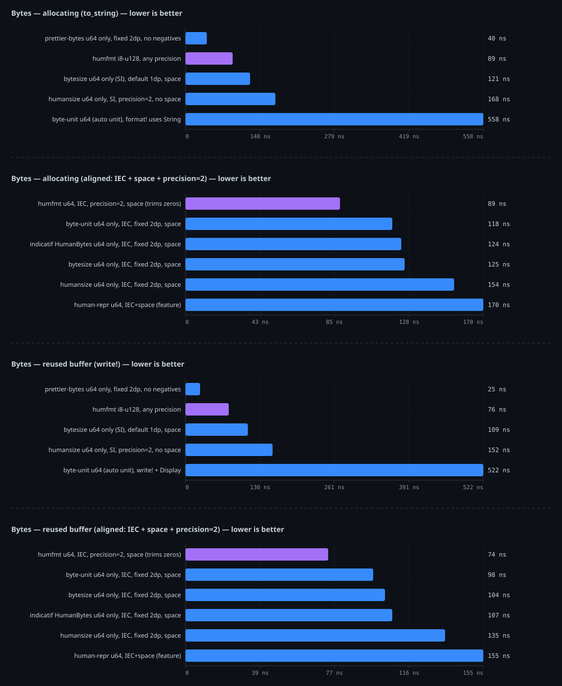
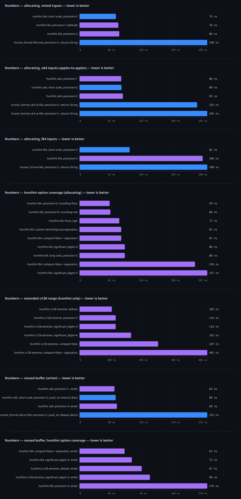
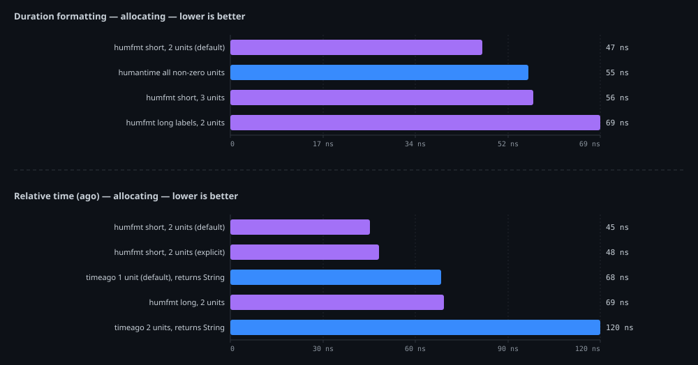

<div align="center">

# humfmt

**Ergonomic human-readable formatting toolkit for Rust**

[](https://github.com/MuXolotl/humfmt/actions/workflows/ci.yml)
[](https://crates.io/crates/humfmt)
[](https://docs.rs/humfmt)


</div>

---

`humfmt` turns raw machine values into readable text without turning formatting
into a side quest.

```rust
use humfmt::Humanize;

println!("{}", 1_500_000.human_number());   // 1.5M
println!("{}", 1536_u64.human_bytes());     // 1.5KB
println!("{}", 0.423_f64.human_percent());  // 42.3%
println!("{}", humfmt::ordinal(21));        // 21st
```

**That's it.** Import the trait, call a method, done.

---

## What it does

| Input | Formatter | Output |
|-------|-----------|--------|
| `15320` | `number` | `15.3K` |
| `1536` | `bytes` | `1.5KB` |
| `0.423` | `percent` | `42.3%` |
| `21` | `ordinal` | `21st` |
| `3661s` | `duration` | `1h 1m` |
| `90s` | `ago` | `1m 30s ago` |
| `["red", "green", "blue"]` | `list` | `red, green, and blue` |

All formatters implement `Display` — no intermediate heap strings. Write directly into any buffer, padded to a width with the usual format specifiers (`{:>10}`).

---

## Quick start

```toml
[dependencies]
humfmt = "0.7"
```

```rust
use humfmt::Humanize;
use core::time::Duration;

// Extension trait — shortest path
println!("{}", 1_500_000.human_number());                     // 1.5M
println!("{}", 1536_u64.human_bytes());                       // 1.5KB
println!("{}", 0.423_f64.human_percent());                    // 42.3%
println!("{}", 42_u32.human_ordinal());                       // 42nd
println!("{}", Duration::from_secs(90).human_ago());          // 1m 30s ago

// Free functions — same result, no trait import needed
println!("{}", humfmt::number(15320));                        // 15.3K
println!("{}", humfmt::bytes(1536));                          // 1.5KB
println!("{}", humfmt::percent(0.423));                       // 42.3%
println!("{}", humfmt::ordinal(21));                          // 21st
println!("{}", humfmt::duration(Duration::from_secs(3661)));  // 1h 1m
println!("{}", humfmt::list(&["red", "green", "blue"]));      // red, green, and blue
```

---

## Customization

Every formatter has a `*_with` variant that takes an options builder: `NumberOptions`,
`BytesOptions`, `PercentOptions`, `DurationOptions`, `AgoOptions` (relative time),
and `ListOptions`. Options are `Copy`, every setter is `const fn`, and the defaults
are what most callers want.

```rust
use core::time::Duration;
use humfmt::{ByteUnit, BytesOptions, DurationOptions, Humanize, NumberOptions, PercentOptions};

// Bytes: binary units, space before the suffix
let disk = 1536_u64.human_bytes_with(BytesOptions::new().binary().precision(2).space(true));
assert_eq!(disk.to_string(), "1.5 KiB");

// Bytes: bits mode for network speeds
let speed = 1_500_000_u64.human_bytes_with(BytesOptions::new().bits(true));
assert_eq!(speed.to_string(), "12Mb");

// Bytes: always show megabytes
let always_mb = 1_500_000_u64.human_bytes_with(BytesOptions::new().unit(ByteUnit::MB).precision(3));
assert_eq!(always_mb.to_string(), "1.5MB");

// Numbers: full digits with grouping instead of compaction
let full = 1_234_567.human_number_with(NumberOptions::new().compact(false).separators(true));
assert_eq!(full.to_string(), "1,234,567");

// Numbers: significant digits instead of decimal places
let sig = 12_345.human_number_with(NumberOptions::new().significant_digits(3));
assert_eq!(sig.to_string(), "12.3K");

// Percentages: fixed precision
let ratio = 0.425_f64.human_percent_with(PercentOptions::new().precision(2).fixed_precision(true));
assert_eq!(ratio.to_string(), "42.50%");

// Durations: long labels, three units
let elapsed = Duration::from_secs(3665).human_duration_with(DurationOptions::new().long_units().max_units(3));
assert_eq!(elapsed.to_string(), "1 hour 1 minute 5 seconds");
```

Every option, default, clamp, and edge case is tabulated in the
[API documentation](https://docs.rs/humfmt).

---

## Lists

```rust
use humfmt::{list, list_with, ListOptions};

// Default: Oxford comma
assert_eq!(
    list(&["red", "green", "blue"]).to_string(),
    "red, green, and blue"
);

// No serial comma
let no_oxford = list_with(
    &["red", "green", "blue"],
    ListOptions::new().no_serial_comma(),
);
assert_eq!(no_oxford.to_string(), "red, green and blue");

// Custom conjunction
let plus = list_with(
    &["red", "green", "blue"],
    ListOptions::new().conjunction("plus").no_serial_comma(),
);
assert_eq!(plus.to_string(), "red, green plus blue");

// Custom separator
let piped = list_with(
    &["red", "green", "blue"],
    ListOptions::new().separator(" | ").conjunction("&"),
);
assert_eq!(piped.to_string(), "red | green & blue");
```

---

## Performance

`humfmt` is designed to be cheap in hot paths:

- **Zero-alloc `Display`** — formatters write directly into the output, no intermediate `String`
- **O(1) scaling** — integer path uses `ilog10`, float path uses IEEE 754 exponent
- **`no_std`** — works without the standard library
- **No dependencies** — core crate has zero required dependencies

See [BENCHMARKS.md](./BENCHMARKS.md) for comparisons against `humansize`, `bytesize`, `byte-unit`, `prettier-bytes`, `human_format`, `numfmt`, `humantime`, `timeago`, and others.

<details>
<summary>Charts</summary>

<p align="center">
  
</p>

<p align="center">
  
</p>

<p align="center">
  
</p>

</details>

---

## Fuzzing

`humfmt` includes a fuzzing harness using `cargo-fuzz` to catch edge cases in numeric and formatting logic.

### Running fuzz targets

Fuzzing requires the **nightly** toolchain.

```bash
# Install cargo-fuzz (once)
cargo install cargo-fuzz

# Run a specific fuzz target
cargo +nightly fuzz run fuzz_number
cargo +nightly fuzz run fuzz_bytes
cargo +nightly fuzz run fuzz_percent
cargo +nightly fuzz run fuzz_duration
cargo +nightly fuzz run fuzz_ordinal
cargo +nightly fuzz run fuzz_list
```

The fuzz targets are located in `fuzz/fuzz_targets/`.

---

## Feature flags

| Feature | Default | Description |
|---------|---------|-------------|
| `std` | ✓ | Standard library build |
| `chrono` | | `chrono::TimeDelta` / `DateTime` adapters |
| `time` | | `time::Duration` / `OffsetDateTime` adapters |

For `no_std` targets:

```toml
[dependencies]
humfmt = { version = "0.7", default-features = false }
```

With ecosystem integrations:

```toml
[dependencies]
humfmt = { version = "0.7", features = ["chrono", "time"] }
```

---

## Documentation

- **[docs.rs](https://docs.rs/humfmt)** — full API reference
- **[BENCHMARKS.md](./BENCHMARKS.md)** — performance comparisons and methodology
- **[CHANGELOG.md](./CHANGELOG.md)** — what changed and when
- **[TODO.md](./TODO.md)** — planned features and known issues
- **[examples/](./examples)** — runnable examples
- **[tests/](./tests)** — integration and property tests

---

## Philosophy

This crate follows one simple rule:

> Human formatting should feel stupidly easy.

No giant config ceremony. No formatting gymnastics. No "why is this so annoying?" moments.

Just:

```rust
use humfmt::Humanize;

println!("{}", 1_500_000.human_number());
```

and move on with your life.

---

## License

MIT.
